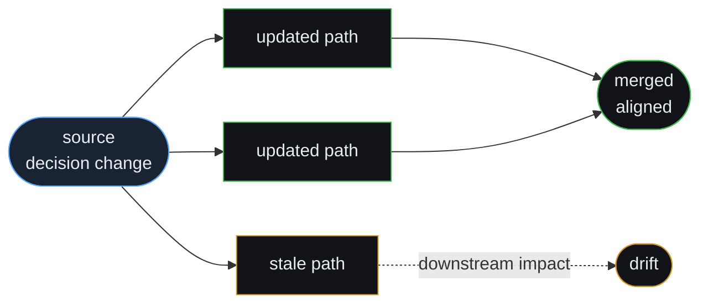

# GPAP AI Labs

**Research-driven software for decision propagation and execution alignment.**

We build tools that make downstream impact visible when product intent changes — before stale context compounds into rework.

**Stage:** Pre-seed · Founder validation · No GA product claims

---

## Mission

Help engineering organizations see **what became wrong** when a product decision changed.

Task trackers record work. Observability records runtime. Documentation stores intent. None of them reliably answer: *which downstream assumptions, tickets, and execution paths are still coupled to a decision you already reversed?*

GPAP AI Labs exists to close that gap with calm, systems-level tooling — not urgency theater, not generic “AI productivity.”

---

## What we are building

**[Kynlet](https://kynlet.com)** is our first product: decision-change impact visibility for technical SaaS teams.

> Kynlet shows what became wrong when a product decision changed.

Kynlet surfaces **stale context** and **downstream drift** after product and technical decisions evolve — the misalignment that often stays invisible until a sprint review, a release, or customer feedback.

We are **not** shipping a task tracker, a documentation platform, or an autonomous engineering control plane. We are building a narrow wedge first: **propagation awareness** and **downstream impact reasoning** at the moment decisions change.

Public narrative and validation materials: **[kynlet-public](https://github.com/gpapai-labs/kynlet-public)**

---

## Why this matters

When direction shifts, execution rarely stops. It keeps moving on assumptions that no longer match current product intent.

```text
  [decision changes]
         │
         ▼
   ┌─────────────┐     some paths update
   │ coordination │────────────────────────► merged execution
   │   junction   │
   └──────┬──────┘
          │
          ├──────────────────────────────► stale branch ──► drift
          │
          └──► tickets, specs, services, docs diverge quietly
```

The failure mode is **stale-context propagation**, not “bad communication.” Founders who have just lived through pivot-induced rework feel this immediately. Our work is to make that propagation legible — structurally, reviewably, and early.



---

## Current focus

| Area | Status |
|------|--------|
| **Commercial wedge** | Locked: decision-change impact for post-MVP technical founders |
| **Product** | Pre-build validation; founder interviews and qualification in progress |
| **Landing / narrative** | [kynlet.com](https://kynlet.com) — honest validation-stage positioning |
| **Evidence** | We do not claim revenue, logos, or production traction in public materials |

Active engineering work stays in private repositories during validation. We publish selectively through **[kynlet-public](https://github.com/gpapai-labs/kynlet-public)** and this organization profile.

---

## Research themes

We think in graphs, but we sell outcomes — not category inflation.

- **Stale-context detection** — identifying assumptions and execution paths that no longer match current product intent
- **Decision-change propagation** — treating a direction change as a first-class event with downstream effects
- **Downstream impact visibility** — what should have received updated context, and what still looks fine on a board but is not
- **Operational graph reasoning** — dependency-style models of how coordination context flows (visual and structural, not “another knowledge graph platform”)
- **Execution alignment** — keeping evolving decisions and work in flight aligned, especially as implementation velocity increases
- **Founder-led validation** — structured interviews, willingness-to-pay probes, and honest pre-build gates

We avoid positioning as workflow automation, generic AI copilots, or enterprise transformation suites.

---

## Founders

**GPAP AI Labs** is founder-led and engineering-first.

| | |
|---|---|
| **Founder** | [Aleksy Pyrz](https://www.linkedin.com/in/aleksypyrz/) |
| **Company site** | [gitpushandpray.ai](https://www.gitpushandpray.ai) |
| **Product** | [kynlet.com](https://kynlet.com) |

We bias toward readable architecture, explicit tradeoffs, and materials that survive technical diligence — not slide-deck inflation.

---

## Contact

- **Product / validation:** [hello@kynlet.com](mailto:hello@kynlet.com)
- **Website:** [kynlet.com](https://kynlet.com)
- **Public materials:** [github.com/gpapai-labs/kynlet-public](https://github.com/gpapai-labs/kynlet-public)

For collaboration or diligence requests, email is preferred. We reply to serious founder and investor conversations during validation; we do not operate a sales queue.

---

<p align="center">
  <sub>GPAP AI Labs · Pre-seed · Building Kynlet</sub>
</p>
